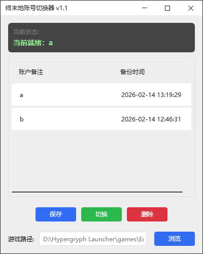

# Endfield Switcher (明日方舟：终末地账号切换器) 

这是一个用于在 PC 端快速切换《明日方舟：终末地》账号的小工具。
基于 WPF (C#) 开发，旨在解决游戏客户端无法保存多账号登录状态的问题。

## 主要功能 

* 支持保存账号数据，给每个存档自定义备注。
* 点击列表即可切换账号，免去反复扫码或输入密码的繁琐。

## 🛠️ 使用方法

1.  打开工具，点击浏览按钮，指定游戏主程序 (`Endfield.exe`) 的路径。
   
3.  **保存账号**：
    * 先正常登录游戏。
    * 点击工具上的 **[保存]** 按钮，输入备注（如“我的大号”）即可存档。
    * 退出游戏。
      
4.  **切换账号**：
    * 请务必先退出游戏！
    * 在列表中选中想要切换的账号。
    * 选中想要登录的账号，点击 **[切换]**。
    * 看到提示成功后，直接启动游戏即可。

# 程序截图

##  特别声明

1.  **自用性质**：本工具最初仅为作者自用开发，**未在其他电脑或系统环境下进行过广泛测试**。
2.  **兼容性**：在作者的电脑上（Win10/Win11）运行正常，但无法保证在您的设备上一定能完美运行。
3.  **关于封号**：本工具原理仅为“物理替换本地缓存文件”，理论上不涉及修改游戏内存或数据，风险极低。但**由此产生的任何账号风险或数据丢失，请自行承担**。
4.  **随缘更新**：如果游戏更新导致工具失效，作者可能会随缘修复。
